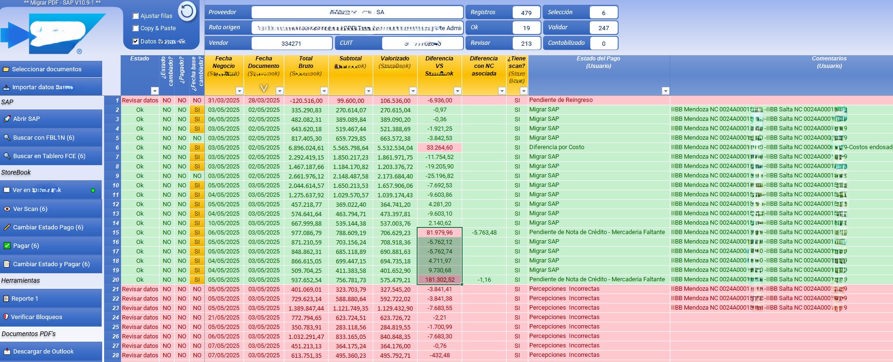
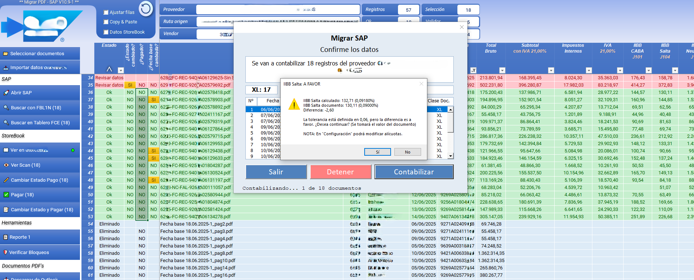
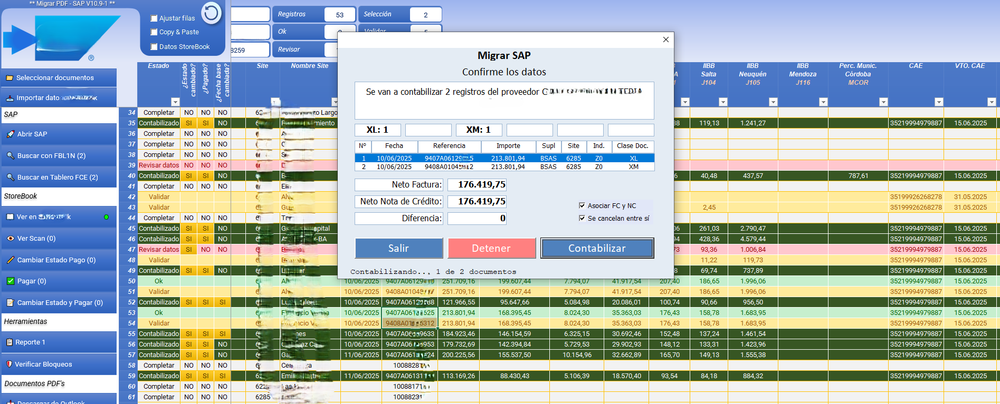
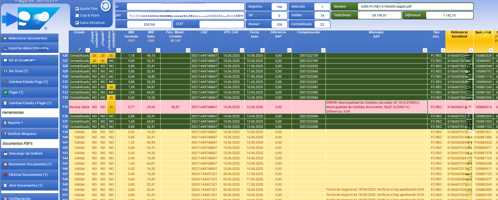

# 🧰 Vista general de la herramienta (UI principal)

## 👥 Audiencia
Este anexo muestra la **UI principal** (tablero operativo) y cómo se usa en la práctica.
Si todavía no lo hiciste: empezá por [README.md](README.md).

➡️ **Vista de formularios (UI forms):** [UI_FORMS_GALLERY.md](UI_FORMS_GALLERY.md)

---

## 1) Tablero operativo (visión end-to-end)
**Qué demuestra**
- Vista consolidada del proceso: extracción + cruce + validaciones + estado por fila.
- Acciones operativas agrupadas (selección, importación, verificación, seguimiento).

**Captura**

**Qué mirar**
- Columna **Estado** y semáforos (OK / Revisar / Validar / Contabilizado).
- Columnas de **diferencias** y control (ej. diferencias vs fuente/cruce).
- Acciones del menú lateral (flujo del operador).

---

## 2) Contabilización por lote (confirmación + controles)
**Qué demuestra**
- Antes de ejecutar acciones masivas, hay un paso de **confirmación**.
- Se muestran totales/resumen y se guía la decisión del usuario.

**Captura**

**Qué mirar**
- Modal “Confirmar los datos” (resumen por clase/doc y totales).
- Botones de control: **Salir / Detener / Contabilizar**.
- Mensajes preventivos antes de continuar.

---

## 3) Caso especial: asociación FC + NC (neto 0 / compensación)
**Qué demuestra**
- El sistema detecta combinaciones relevantes (por ejemplo, documentos que matchean).
- Habilita acciones específicas con checks de seguridad para evitar errores.

**Captura**

**Qué mirar**
- Resumen comparativo (Neto Factura / Neto Nota de Crédito / Diferencia).
- Checkboxes de confirmación para asociar/cancelar correctamente.

---

## 4) Mensajes y excepciones (alertas trazables)
**Qué demuestra**
- Cuando hay inconsistencias, se genera un **mensaje explícito** y accionable.
- La UI resalta el problema para priorizar revisión.

**Captura**

**Qué mirar**
- Columna de **Mensajes** con explicación clara del error/diferencia.
- Registros afectados marcados para revisión.

---