# 🖥️ Galería de UI (UserForms): evidencia visual del flujo

## 👥 Audiencia

Este anexo es para quien quiera ver la **interfaz operativa** de la herramienta (formularios, pasos y controles).
Si todavía no lo hiciste: empezá por [README.md](README.md).

➡️ **Vista general (UI principal):** [TOOL_UI_OVERVIEW.md](TOOL_UI_OVERVIEW.md)

---

## 👁️ Qué vas a ver

En este release público, la UI se muestra con:

- Capturas sanitizadas (sin datos sensibles).
- Captions cortos por formulario (qué resuelve y cuándo se usa).
- Variantes del mismo formulario cuando aplica.

---

## ✅ Convención de rutas (capturas)

Todas las imágenes viven en:

```
assets/ui/forms/
```

> Recomendación: evitar acentos en nombres de archivos para evitar problemas de path.  
> Ej.: usar `Configuracion.png` (sin tilde).

---

## 📂 Índice de capturas

| Formulario | Captura |
|---|---|
| Configuración | `assets/ui/forms/Configuracion.png` |
| Importar | `assets/ui/forms/Importar.png` |
| Ruta de carpeta | `assets/ui/forms/RutaCarpeta.png` |
| Bloqueo B | `assets/ui/forms/BloqueoB.png` |
| Bloqueo B (output) | `assets/ui/forms/BloqueoB_output.png` |
| Paso 2 | `assets/ui/forms/Paso2.png` |
| Paso 3 (base) | `assets/ui/forms/Paso3.png` |
| Paso 3 (variant) | `assets/ui/forms/Paso3_variant.png` |
| Paso 3 (variant 2) | `assets/ui/forms/Paso3_variant2.png` |
| Paso 3 (alert) | `assets/ui/forms/Paso3_alert.png` |
| Password | `assets/ui/forms/Password.png` |
| Password SB | `assets/ui/forms/Password_SB.png` |
| Progress Bar | `assets/ui/forms/ProgressBar.png` |
| Visualizar Scan (1) | `assets/ui/forms/VisualizarScan1.png` |
| Visualizar Scan (2) | `assets/ui/forms/VisualizarScan2.png` |

---

## 1️⃣ Configuración (`Configuración.frm`)

**¿Para qué sirve?**

- Configura parámetros del flujo (tolerancias, switches operativos, rutas/flags según release).
- Define cómo se corre la importación y qué validaciones se aplican.
- Gestiona credenciales/confirmaciones cuando el entorno no permite leerlas automáticamente.

**Captura**

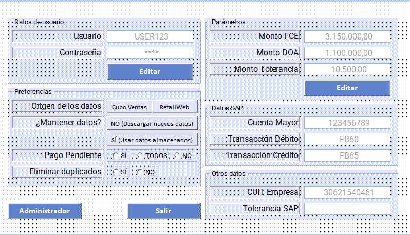

**Qué mirar**

- Tolerancias y flags operativos.
- Acciones de guardar/confirmar.

---

## 2️⃣ Importar (`formImportar.frm`)

**¿Para qué sirve?**

- Permite iniciar una importación masiva seleccionando proveedores/criterios operativos.
- Ofrece búsqueda por nombre o identificador.
- Al confirmar, pobla la tabla operativa según la fuente configurada.

**Captura**

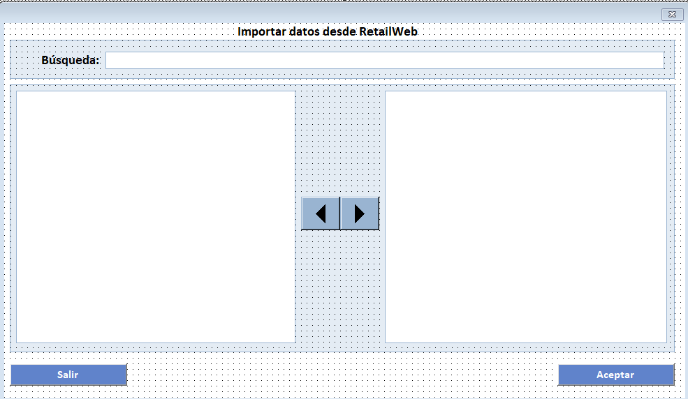

**Qué mirar**

- Campo de búsqueda.
- Lista de selección (agregar/quitar).
- Botón "Aceptar" como inicio de corrida.

---

## 3️⃣ Ruta de carpeta (`FormRutaCarpeta.frm`)

**¿Para qué sirve?**

- Define/valida la carpeta de trabajo donde se organizan documentos.
- Incluye acciones operativas asociadas a la obtención/organización de PDFs (según configuración del entorno).
- Permite controlar el comportamiento de post-proceso (por ejemplo, marcar o no correos como leídos cuando aplique).

**Captura**

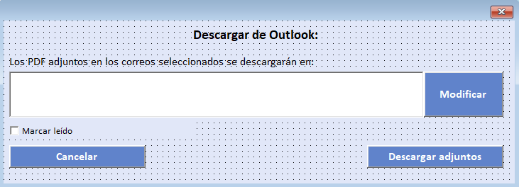

**Qué mirar**

- Selector/modificación de ruta.
- Acciones de descarga/organización (si están disponibles en tu build).

---

## 4️⃣ Bloqueo B (`form_BloqueoB.frm`)

**¿Para qué sirve?**

- Flujo asistido para casos especiales (documentos bloqueados o con verificación adicional).
- Centraliza verificación y consulta cruzada contra sistemas externos cuando el caso lo requiere.

**Capturas**

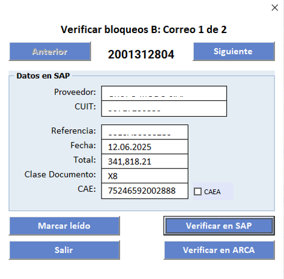
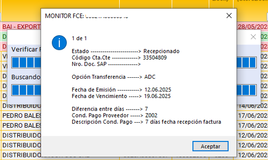

**Qué mirar**

- Campos autocompletados vs editables.
- Navegación por pasos (anterior / siguiente / verificar).

---

## 5️⃣ Paso 2 (`Paso2.frm`)

**¿Para qué sirve?**

- Paso de revisión cuando se detectan discrepancias en impuestos/alícuotas.
- Permite comparar valores del documento contra valores persistidos/configurados.

**Captura**

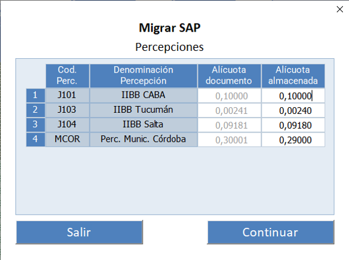

**Qué mirar**

- Campos bloqueados (valores del documento).
- Campos habilitados (valores a confirmar/ajustar).

---

## 6️⃣ Paso 3 (`Paso3.frm`)

### 6.1 Vista base (pre-acción)

**¿Para qué sirve?**

- Resume los documentos seleccionados y el estado previo a la acción final.
- Permite una verificación visual antes de continuar con el flujo.

**Captura**

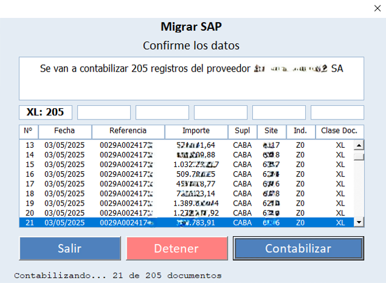

**Qué mirar**

- Tabla de datos (fecha / referencia / importes).
- Botones de acción (salir / detener / continuar).

### 6.2 Variantes (casos especiales)

**¿Para qué sirve?**

- Habilita acciones/controles extra cuando el caso detectado requiere lógica especial (por ejemplo: asociación entre documentos o cancelaciones controladas).
- Expone checks/confirmaciones adicionales para evitar errores operativos.

**Capturas**

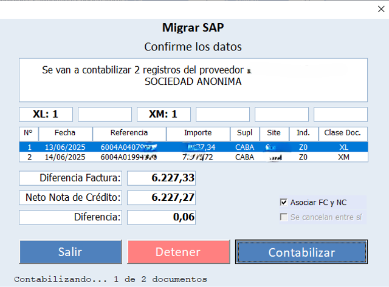
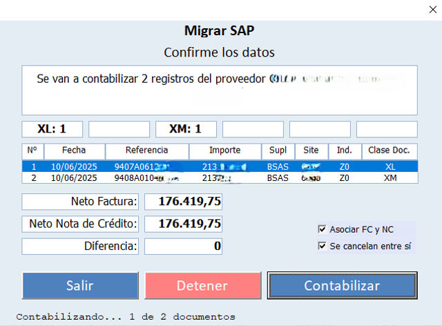
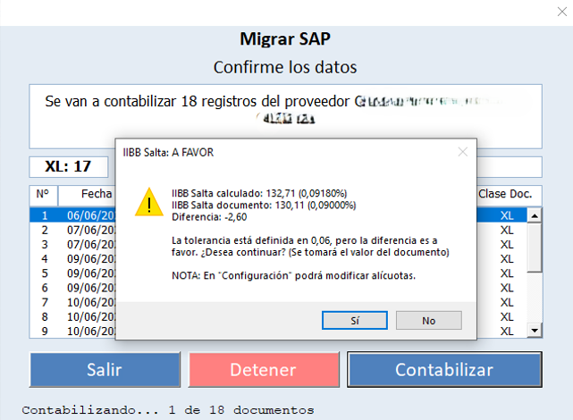

**Qué mirar**

- Campos de cálculo/resumen (bloqueados).
- Checkboxes de confirmación y mensajes preventivos.

---

## 7️⃣ Password (`Password.frm`)

**¿Para qué sirve?**

- Confirmación de credenciales para acciones puntuales del flujo (según entorno/seguridad).

**Captura**

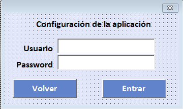

---

## 8️⃣ Password SB (`Password_SB.frm`)

**¿Para qué sirve?**

- Variante de credencial/confirmación cuando el entorno no permite lectura automática.

**Captura**

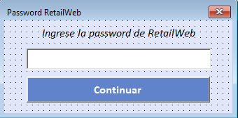

---

## 9️⃣ ProgressBar (`ProgressBar.frm`)

**¿Para qué sirve?**

- Feedback visual del proceso (avance por etapas, esperas, mensajes de "qué está ocurriendo").

**Captura**

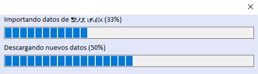

**Qué mirar**

- Progreso por etapa.
- Mensajes de estado.

---

## 🔟 Visualizar Scan (`VisualizarScan.frm`)

**¿Para qué sirve?**

- Soporta escenarios donde no se cuenta con el PDF local y se requiere validación/carga asistida.
- Muestra evidencia documental (scan) asociada al registro seleccionado.
- Permite confirmar datos precargados o completar datos faltantes con controles guiados.

**Capturas**

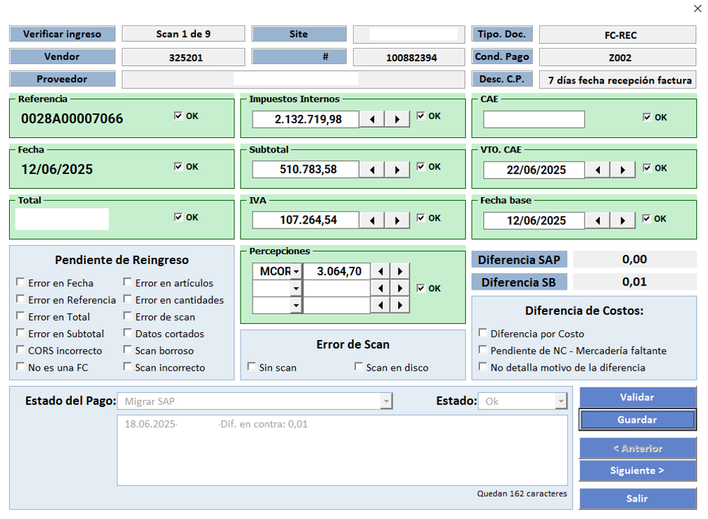
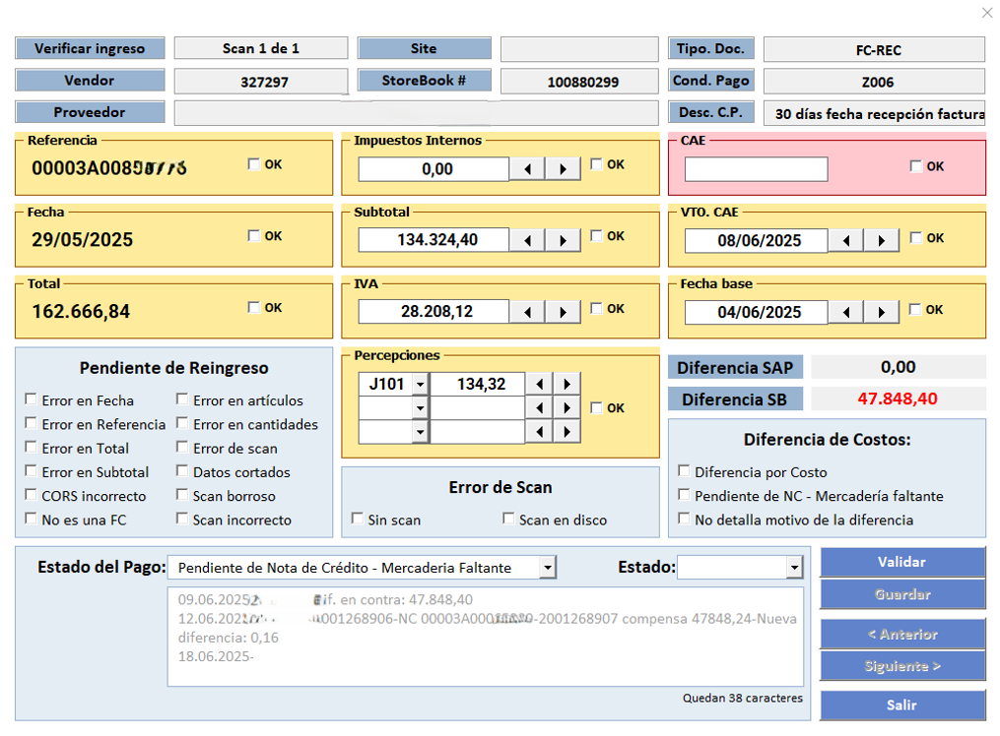

**Qué mirar**

- Qué datos se completan automáticamente vs manual.
- Validaciones por checkbox/estado visual.
- Indicadores cuando faltan datos o hay inconsistencias.

